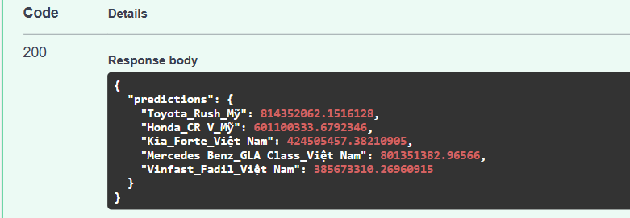

# Dự Án Dự Đoán Giá Xe Hơi

1. **Tên người thực hiện:** Trương Văn Khải.

## **Tổng quan**

Dự án này nhằm xây dựng một hệ thống dự đoán giá xe hơi dựa trên tập dữ liệu về thông tin xe hơi. Kho lưu trữ được tổ chức để hỗ trợ một quy trình phân tích có cấu trúc, bao gồm tiền xử lý dữ liệu, phân tích dữ liệu khám phá (EDA), huấn luyện mô hình và suy luận dự đoán. Kết quả cuối cùng là một API có khả năng trả về dự đoán giá xe dựa trên các đặc điểm đầu vào.

---

## **Cấu trúc dự án**

```
├── api
│   ├── __pycache__
│   ├── app.py          # Tệp chính triển khai API phục vụ suy luận
│   └── utils.py        # Tệp chứa các hàm tiện ích cho API
├── data
│   ├── processed       # Dữ liệu đã qua xử lý, sẵn sàng cho huấn luyện
│   └── raw             # Dữ liệu thô, chưa qua xử lý
├── models              # Thư mục chứa các mô hình đã được huấn luyện
├── notebooks
│   ├── 1_Vucar_prepare_store_dict.ipynb   # Chuẩn bị từ điển ánh xạ cho các biến bị thiếu.
│   ├── 2_Vucar_handle_missing_value.ipynb # Xử lý các giá trị thiếu trong tập dữ liệu.
│   ├── 3_Vucar_build_model.ipynb          # Xây dựng và huấn luyện mô hình.
│   ├── 4_Vucar_inference_onTest.ipynb     # Suy luận và dự đoán trên tập dữ liệu kiểm thử.
│   └── 5_Vucar_EDA.ipynb                  # Phân tích dữ liệu khám phá (EDA).
├── src
│   └── Hiện chưa có.
├── tests
│   └── test.json       # Bộ kiểm thử cho API
├── README.md           # Tài liệu mô tả dự án
```

## **Nội dung các thư mục chính**

### **0. Data**

- **data/raw**: Chứa tập dữ liệu ban đầu, chưa qua xử lý. [Link](https://drive.google.com/file/d/14-oWkLU--L3_9ZdlWDgEj4pnUg8ovE9s/view)
- **data/processed**: Chứa dữ liệu đã được làm sạch và biến đổi để sử dụng cho huấn luyện và đánh giá.
- **data/store_dict**: Chưa từ điển ánh xạ để xử lý dữ liệu thiếu.

### **0. tests**

- Chứa các tệp kiểm thử (`test.json`) dùng để kiểm tra hoạt động của API và đảm bảo kết quả dự đoán hợp lý.

### **1. Xây dựng mô hình: Xây dựng mô hình đáp ứng các tiêu chí sau:**

- Thực hiện code ở các file trong đường dẫn `notebooks\`:
  - **1_Vucar_prepare_store_dict.ipynb**: Chuẩn bị từ điển ánh xạ cho các biến bị thiếu. (Dựa trên các {manufacture_date, brand, model}, lấy ra được thuộc tính (màu, số chỗ ngồi, nguyên liệu, ...) + Kết hợp ChatGPT API cho các trường hợp hiếm (Tất cả xe có cùng {manufacture_date, brand, model} đều bị thiếu cùng 1 thuộc tính)).
  - **2_Vucar_handle_missing_value.ipynb**: Xử lý các giá trị thiếu trong tập dữ liệu dựa trên từ điển ánh xạ xây dựng ở bước 1.
  - **3_Vucar_build_model.ipynb**: Tiến hành training hai loại model là LBGM và CatBoost với chiến lược CrossValidation với KFolds = 5, dựa trên dữ liệu đã được xử lý và tăng cường (thêm một số trương thông tin bổ trợ, từ đó cải thiện được hiệu suất của pipeline).
  - **4_Vucar_inference_onTest.ipynb**: Sử dụng Ensemble để kết hợp kết quả dự đoán của các model. Sau đó đánh giá trên thang đó Mean Absolute Error (MAE).

### **2. Xác định thang đo: Thiết lập số liệu để đo lường hiệu quả hiệu suất của mô hình.**

#### Tại Sao Nên Sử Dụng MAE (Sai Số Tuyệt Đối Trung Bình) Cho Dữ Liệu Dự Đoán Xe Từ Nguồn Thực Tế?

Trong bài tập này, khi làm việc với các tập dữ liệu thực tế trong các bài toán dự đoán giá xe hơi, việc chọn một thang đo đánh giá phù hợp là rất quan trọng. Sau đây là lý do vì sao em quyết định lựa chọn thang đo Mean Absolute Error (MAE):

##### 2.1. **Dễ Hiểu và Diễn Giải**

- MAE đo lường trung bình độ lệch tuyệt đối giữa giá trị dự đoán (giá xe hơi mà model dự đoán) và giá trị thực tế (giá xe hơi thực tế) mà không quan tâm đến hướng sai lệch (dự đoán cao hơn hay thấp hơn giá trị thực). Ngoài ra, sai số được biểu diễn bằng cùng đơn vị với dữ liệu thực tế, giúp dễ dàng hiểu được ý nghĩa thực tiễn của sai số này, từ đó có thể cải thiệc được hiệu suất.

**Ví dụ:** Nếu MAE là `A`, điều này có nghĩa trung bình mỗi lần dự đoán lệch `A` so với giá trị thực tế.

##### 2.2. **Xử Lý Tốt Dữ Liệu Nhiễu và Ngoại Lệ**

- **Ít Nhạy Cảm Với Sai Số Quá Lớn So Với MSE:** Dữ liệu thực tế thường chứa nhiều nhiễu và có thể xuất hiện các giá trị ngoại lệ do một số yếu tố bên ngoài, từ đó dẫn đến giá trị của xe hơn trong tập groud_truth sẽ cao hơn nhiều hoặc thấp hơn nhiều so với giá trị lúc bán ra. Do vậy: Sử dụng MAE phạt các sai số lớn theo tỷ lệ tuyến tính, trong khi Mean Squared Error (MSE) sẽ phạt nặng các sai số lớn do chúng bị bình phương (Giảm được sự ảnh hưởng của những giá trị ngoại lai).

##### 2.3. **So Sánh Giữa Các Mô Hình Dễ Dàng Hơn**

- MAE cung cấp phép đo sai số trung bình nhất quán giữa các loại mô hình khác nhau mà không bị ảnh hưởng bởi quá lớn nếu dùng chung một bộ dữ liệu. Vì vậy, MAE giúp đánh giá độ chính xác trung bình mà không bị ảnh hưởng bởi các dự đoán có sai số quá lớn.
- Không giống như MSE, MAE không phạt nặng một số dự đoán sai quá lớn.

### **3. Xây dựng API: Phát triển API RESTful cho mô hình được đề cập ở trên**

- Được em xây dựng ở đường dẫn `api/app.py`.
- Lưu các mô hình đã được huấn luyện, checkpoint và các tệp mô hình đã được train ở `models/`.

#### **3.1. Mô hình của bạn hoạt động tốt như thế nào?**

##### **3.1.1. Đánh giá với thang đo MAE.**

1. **Thông tin từ bảng thống kê mô tả (`notebooks\5_Vucar_EDA.ipynb`):**

   - Số lượng mẫu dữ liệu: 81.406 mẫu.
   - Giá xe hơi (cột `price`):
     - Giá trị trung bình: 5.972.847.000 đồng (~6 tỷ đồng).
     - Giá trị tối thiểu: 1.310.720 đồng.
     - Giá trị tối đa: 37.500.000.000 đồng (~37,5 tỷ đồng).
     - Phân vị 25%: 2.990.000.000 đồng (~3 tỷ đồng).
     - Phân vị 50% (median): 4.690.000.000 đồng (~4,69 tỷ đồng).
     - Phân vị 75%: 6.800.000.000 đồng (~6,8 tỷ đồng).

2. **Score MAE của mô hình dự đoán (`notebooks\4_Vucar_inference_onTest.ipynb`):**

   - MAE (Mean Absolute Error) là 253.377.168 đồng (~253 triệu đồng).

3. **Nhận xét:**

   - **So sánh với mức trung bình giá xe:** Mức MAE khoảng 253 triệu đồng là khá nhỏ khi so với giá trung bình của xe (~6 tỷ đồng). Điều này cho thấy sai số dự đoán chỉ chiếm khoảng **4,24%** so với giá trung bình.
   - Có thể nói: Phương pháp mà em xây dựng hoạt động **khá tốt** trong bối cảnh dữ liệu giá trị xe có sự phân tán lớn, từ hơn 1 triệu đồng đến hơn 37 tỷ đồng.
   - Sai số MAE ở mức vài trăm triệu đồng (~253 triệu đồng) chưa thể chấp nhận được đối với dữ liệu thực tế, vì thị trường thực tế là nơi khá khắc nhiệt, sai lệch một vài trăm nghìn thì cũng đã ảnh hưởng đến kết quả của buổi thương thảo rồi.

##### **3.1.2. Đánh giá với dữ liệu thực tế.**

- Em tiến hành lấy ra 5 mẫu dự liệu từ trang `https://dinhgiaxe.vucar.vn/`, dữ liệu được lưu ở `tests\real_data.json`, giá xe trên đó được lưu ở `tests\real_price.txt`. Sau đó tiến hành đưa 5 mẫu dữ liệu đó vào dự đoán trong pipeline của em.

- Đây là kết quả dự đoán của em:
  

  | Tên Xe                           | Giá Thực Tế           | Giá Dự Đoán     |
  | -------------------------------- | --------------------- | --------------- |
  | Toyota Rush Mỹ                   | 528 triệu - 536 triệu | 814,352,062 VND |
  | Honda CR-V Mỹ                    | 819 triệu - 829 triệu | 601,100,334 VND |
  | Kia Forte Việt Nam               | 285 triệu - 287 triệu | 424,505,457 VND |
  | Mercedes-Benz GLA Class Việt Nam | 674 triệu - 675 triệu | 801,351,383 VND |
  | Vinfast Fadil Việt Nam           | 326 triệu - 337 triệu | 385,673,310 VND |

- **Nhận xét:**
  - **Toyota Rush Mỹ:** Giá dự đoán cao hơn giá thực tế khoảng **278 triệu VND**. Đây là sự chênh lệch đáng kể.
  - **Honda CR-V Mỹ:** Giá dự đoán thấp hơn giá thực tế khoảng **218 triệu VND**, cho thấy sự đánh giá thấp hơn thực tế.
  - **Kia Forte Việt Nam:** Giá dự đoán cao hơn khoảng **140 triệu VND**, mức chênh lệch này khá lớn.
  - **Mercedes-Benz GLA Class Việt Nam:** Giá dự đoán cao hơn khoảng **126 triệu VND**, tuy nhiên với dòng xe sang thì mức chênh lệch này tương đối bình thường.
  - **Vinfast Fadil Việt Nam:** Giá dự đoán cao hơn khoảng **50 triệu VND**, đây là mức sai lệch nhỏ và có thể coi là trong giới hạn chấp nhận được.

#### Tổng kết:

- **Xe dự đoán đúng nhất:** Vinfast Fadil Việt Nam với mức chênh lệch chỉ **50 triệu VND**, cho thấy mô hình có thể đã hoạt động tốt hơn với các xe sản xuất nội địa.
- **Xe dự đoán sai nhiều nhất:** Toyota Rush Mỹ với mức chênh lệch **278 triệu VND**, cho thấy sự khác biệt lớn có thể do thiếu dữ liệu chi tiết về phiên bản hoặc các yếu tố địa lý, thuế nhập khẩu.
- Đối với dữ liệu thực tế, có thể kết luận được rằng hệ thống mà em xây dựng chưa tốt, chưa thể đáp ứng yêu cầu và chưa thể triển khai cho sản phẩm thực tế được.

#### **3.2. Chỉ số được chọn có hiệu quả như thế nào trong việc đánh giá hiệu suất của mô hình?**

Sử dụng chỉ số MAE (Mean Absolute Error) là một lựa chọn hiệu quả để đánh giá hiệu suất của mô hình trong bối cảnh này vì:

- MAE đo lường sai số trung bình tuyệt đối giữa giá trị dự đoán và giá trị thực tế. Cho người dùng có thể thấy ngay được sự sai lệch giữ giá trị dự đoán và giá trị thực tế, từ đó có thể cải thiện và quyết định nên tin vào giá dự đoán mà model đưa ra hay không.
- Chỉ số này dễ hiểu và cung cấp thông tin trực quan về mức chênh lệch trung bình mà người dùng có thể mong đợi trong dự đoán giá.
- Nếu MAE thấp, điều này cho thấy mô hình hoạt động tốt trong việc dự đoán gần sát với giá thực tế, và ngược lại.

#### **3.3. Mô hình của bạn có thể được cải thiện như thế nào?**

Đầu tiên, sau khi đánh giá mô hình, thì kết quả về hiệu suất mà model của em đưa ra là chưa tốt, vì vậy, em cần phải cải thiện khá nhiều để có thể đạt được hiệu suất tốt:

1. Lựa chọn phương thức xử lý dữ liệu thiếu, xử lý các giá trị categorical feature bằng cách khác để có thể so sánh và tìm ra được phương thức tốt nhất cho bài toán này.
2. Bổ sung thêm dữ liệu, vì nếu em đã có được một pipeline chuẩn, thì nếu càng nhiều data thì kết quả mà hệ thống đưa ra sẽ càng chính xác hơn nữa.
3. Tìm kiếm và bổ sung thêm các cột dữ liệu hữu ứng (Các kĩ thuật trích xuất dữ liệu, một vài trường dữ liệu mới được em tạo ra trong file `notebooks\3_Vucar_build_model.ipynb`), từ đó mà em có thể có thêm nhiều trường thông tin hữu ích -> cải thiện được hiệu suất.
4. Về model: Tiến hành Ensemble nhiều loại model cho bài toán hồi quy hơn, ngoài ra có thể sử dụng kĩ thuật Grid Search hay Random Search để tìm ra được một bộ params chuẩn phù hợp với từng loại model.
5. Đánh giá hiệu suất trên nhiều thang đo khác ngoài MAE, từ đó có thể thu nhận được cái nhìn tổng quát hơn về hiệu suất hay những điều còn thiếu sót cho hệ thống của mình -> từ đó có thể cải thiện được hiệu suất.

### **4. Data Analysis Questions**

- Được em thực hiện và diễn giải ở đường dẫn `notebooks\5_Vucar_EDA.ipynb`.

## **Hướng dẫn sử dụng**

### **1. Thiết lập môi trường**

1. Python 3.10.16
2. Cài đặt các package:

   ```bash
   pip install -r requirements.txt
   ```

3. Api:

- Chạy `app.py` trong thư mục `api/` để khởi chạy API:
  ```bash
  cd api
  python app.py
  ```
- Gửi yêu cầu POST với dữ liệu đầu vào (ví dụ như `hãng xe`, `mẫu xe`, `năm sản xuất`, `quãng đường đã đi`, v.v.) để nhận dự đoán giá xe.

### Ví dụ yêu cầu API:

Xem chi tiết ở: `tests\`
